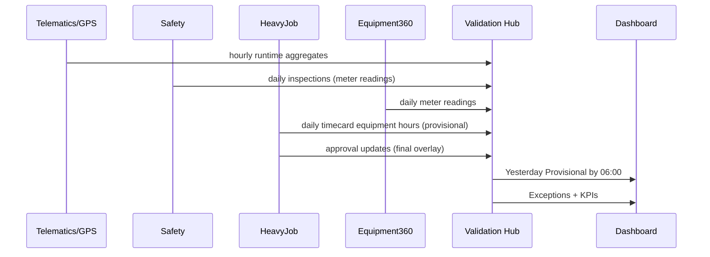

# Diagrams

```mermaid
sequenceDiagram
  participant GPS as Telematics/GPS
  participant SAF as Safety
  participant HJ as HeavyJob
  participant E360 as Equipment360
  participant HUB as Validation Hub
  participant DASH as Dashboard

  GPS->>HUB: hourly runtime aggregates
  SAF->>HUB: daily inspections (meter readings)
  E360->>HUB: daily meter readings
  HJ->>HUB: daily timecard equipment hours (provisional)
  HJ->>HUB: approval updates (final overlay)
  HUB->>DASH: Yesterday Provisional by 06:00
  HUB->>DASH: Exceptions + KPIs
```
