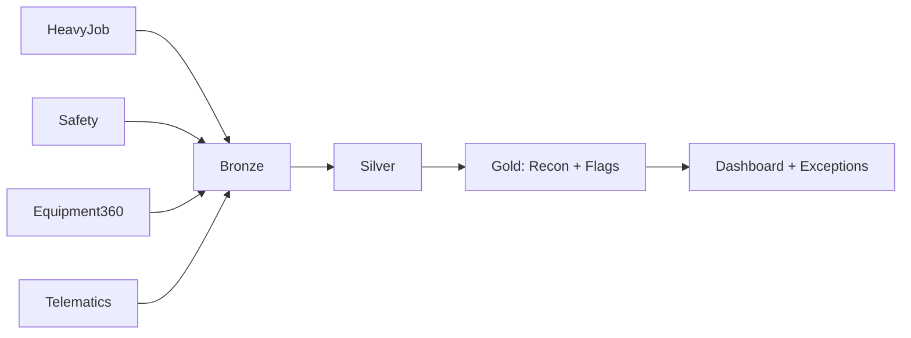

# Architecture Overview

## Inputs
- HeavyJob (timecards + equipment hours)
- Safety Inspections (meter readings + evidence)
- Equipment360 (meter readings + maintenance context)
- Telematics/GPS (engine runtime)

## Data layers (medallion)
- **Bronze:** raw JSON snapshots + request metadata
- **Silver:** normalized source facts
- **Gold:** reconciled Equipment-Day facts + flags + exceptions queue

## Design principle
Do not block on approvals: compute provisional daily; overlay final continuously.

