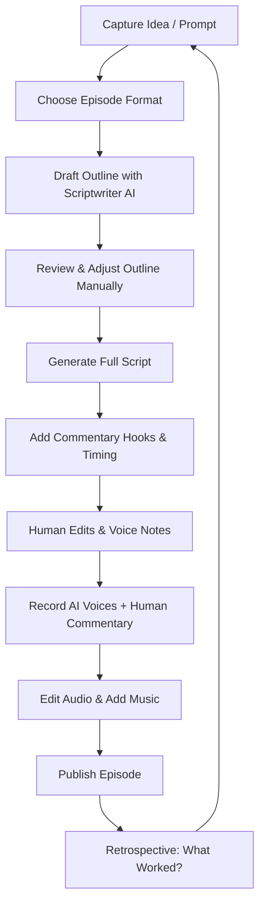

# Tangent Forge Scriptwriter — Writer's Workflow

## Step Breakdown

1. **Capture Idea / Prompt**
   - From real conversations, random thoughts, listener prompts, or Mad Libs inputs.
   - Log in Notion "Ideas & Fragments" database.

2. **Choose Episode Format**
   - Decide: AI Journey, Bridge, Mad Libs, Story, Tangent Map, Framework, Reflection.
   - Consider emotional vibe, topic depth, and production energy.

3. **Draft Outline with Scriptwriter AI**
   - Ask for a beat sheet with section headings, key turns, and suggested length.

4. **Review & Adjust Outline Manually**
   - Tweak beats, add/remove tangents, adjust tone.

5. **Generate Full Script**
   - Have the assistant write the full script, respecting the outline.

6. **Add Commentary Hooks & Timing**
   - Insert [PAUSE FOR HOST REACTION] and timing notes.
   - Mark places where you want to riff or add personal examples.

7. **Human Edits & Voice Notes**
   - Mark tough lines, pronunciation notes, emphasis cues.
   - Adjust anything that doesn’t sound like you.

8. **Record AI Voices + Human Commentary**
   - Use TTS for AI parts; record your parts live.
   - Optionally record a “watch-along” reaction to the AI segment.

9. **Edit Audio & Add Music**
   - Balance pacing, trim dead air, add subtle music if desired.

10. **Publish Episode**
    - Write show notes and a brief description of the theme.
    - Tag it in Notion (Format, Vibe, Topic Depth).

11. **Retrospective**
    - What landed emotionally?
    - What formats felt easiest or hardest?
    - Feed these insights back into future prompts and templates.
